# Minecraft 1.12.2 Forge環境でConditionを利用しconfigの値によってレシピの追加を制御したときのマルチプレイにおけるサーバーとクライアントでconfigの値が異なる場合にクラフトで生じる現象の検証

内容はタイトルの通り。

## 結論

サーバーとクライアントでconfigの値が異なる場合はサーバー側のconfigの値によって追加されたレシピが有効である。しかしこの場合、クライアント側ではクラフト直後にインベントリ内のアイテムが正しく表示されないという問題が発生する。この問題は発生後クライアント側のインベントリがサーバー側と同期されることによって解消される。（なお、ここではこの問題自体を回避する方法については論議しない）

## 検証に使用するconfigの値とレシピ

configの`PizzaMarinaraRequiresSeedOil`の値（真偽値）によって、以下の2種類のレシピのうちどちらが読み込まれるかが決まる。各レシピの読み込みは`Condition`を利用して制御している。

### レシピA

`PizzaMarinaraRequiresSeedOil`が`true`のときは、Seed Oilを要求するレシピが読み込まれる。

[`assets/pizzamarinaraforhac/recipes/food/pizza_marinara_raw_seed_oil.json`](https://github.com/Iunius118/PizzaMarinaraForHaC/blob/master/src/main/resources/assets/pizzamarinaraforhac/recipes/food/pizza_marinara_raw_seed_oil.json)    
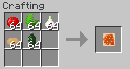

### レシピB

`PizzaMarinaraRequiresSeedOil`が`false`のときは、Seed Oilを要求しないレシピが読み込まれる

[`assets/pizzamarinaraforhac/recipes/food/pizza_marinara_raw.json`](https://github.com/Iunius118/PizzaMarinaraForHaC/blob/master/src/main/resources/assets/pizzamarinaraforhac/recipes/food/pizza_marinara_raw.json)  
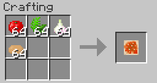

## 検証結果

レシピA及びBをクラフトした結果をサーバーとクライアントの`PizzaMarinaraRequiresSeedOil`の値ごとに記した。

### サーバーとクライアントが両方ともtrue

#### レシピA

クラフト可能。

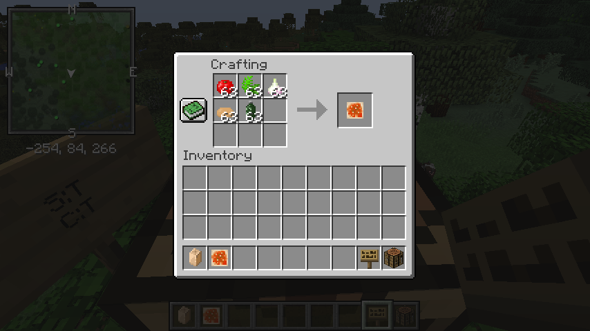

#### レシピB

クラフト不可。

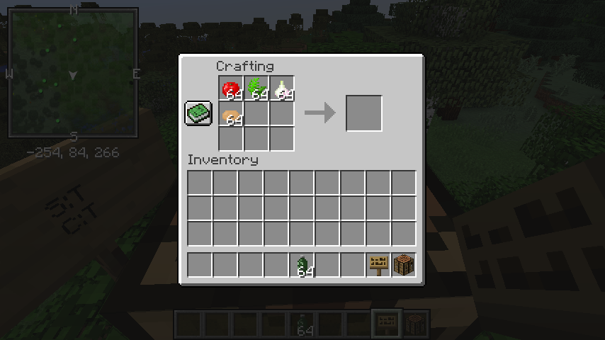

### サーバーがfalseでクライアントもfalse

#### レシピA

クラフト不可。

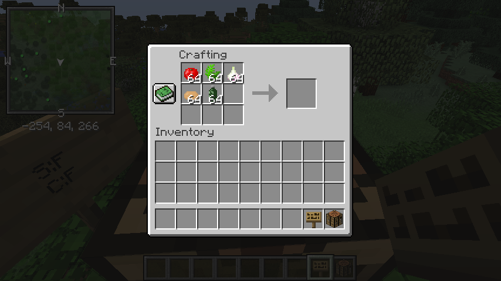

#### レシピB

クラフト可能。

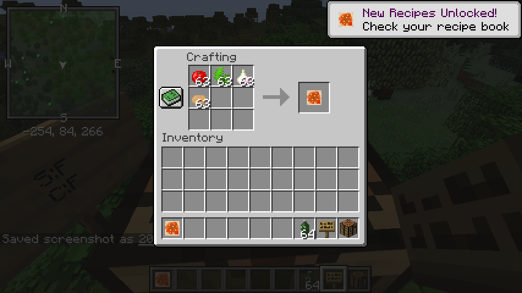

### サーバーとクライアントが両方ともfalse

#### レシピA

クラフト可能。しかしクラフト直後はクライアント側のアイテム数が正しく表示されない。これはクラフトGUIを閉じてインベントリを同期することで解消される（一番下の画像）。

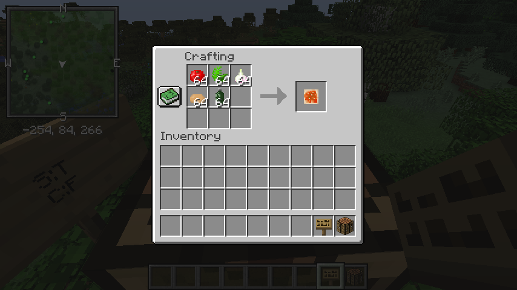  
  
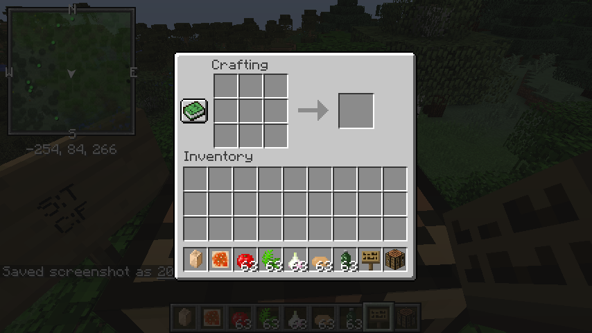

#### レシピB

クラフト不可。

### サーバーがfalseでクライアントがtrue

#### レシピA

クラフト不可。

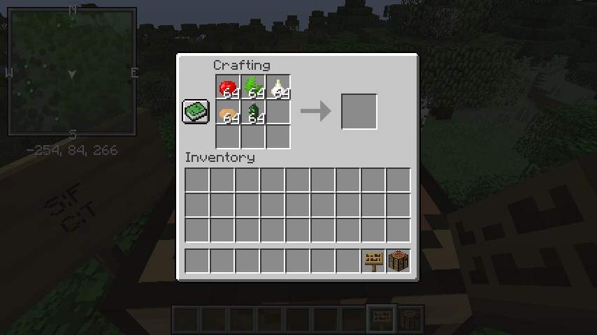  

#### レシピB

クラフト可能。しかしクラフト直後はクライアント側のアイテム数が正しく表示されない。これはクラフトGUIを閉じてインベントリを同期することで解消される（一番下の画像）。

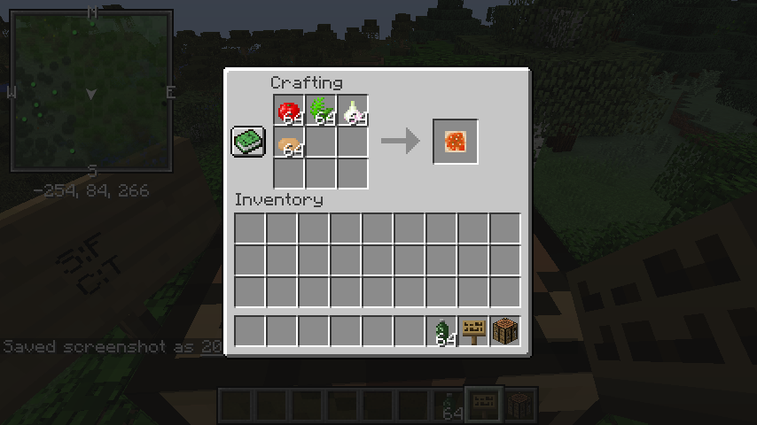  
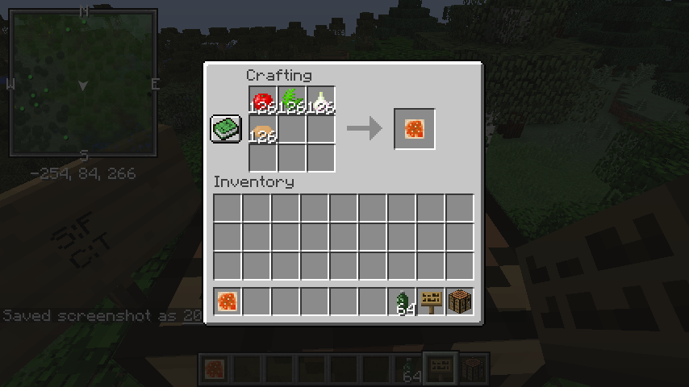  
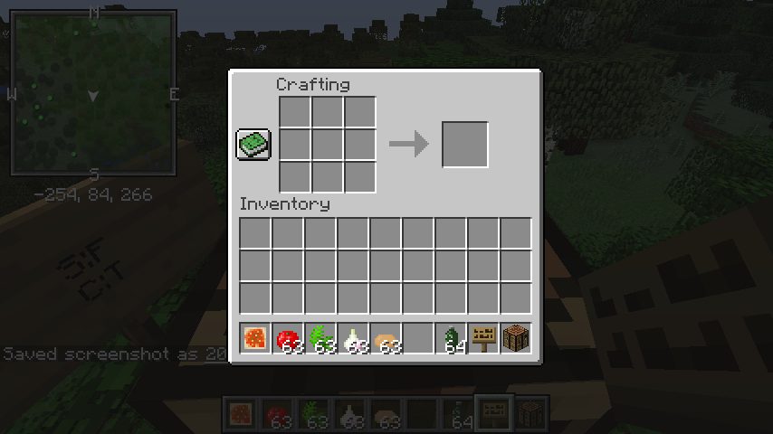
